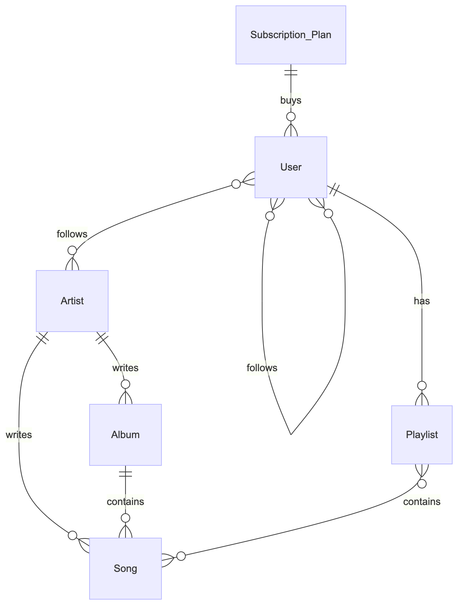

S# Design Document

By Manish Chepuri

Short video overview: <https://youtu.be/PwAPYazaz24>

## Scope

This database represents the fundemental entities within the Spotify system to manage users and artists and their connections. Within the database's scope includes:

* Artists, including basic identification information
* Users, including date the account was created, subscription the user is on, and basic indentification information
* Songs, including the date the song was uploaded, the album it's in if applicable, and basic indentification information
* Playlists, including the date created, the user id it belongs to, and basic indentification information
* Albums, including the date it was uploaded, the artist who made it, and basic indentification information
* Followers, users following other users and users following artists

Out of scope are elements like chats, listening statistics, recently played songs, song reviews, likes, ratings, comments, song genres, and podcasts. Additionally, this database only stores metadata about the songs and not the song itself.

## Functional Requirements

This database will support:

* CRUD operations for songs, albums, playlists, users, and artists
* Tracking the followings between users and between users and artists

It will not support 1 way followings between users, albums and songs being written by multiple artists

## Representation

Entities are captured in SQLite tables with the following schema.

### Entities

The database includes the following entities:

#### Subscription Plans
The `subcription_plans` table includes:
* `id`, which specifies the unique indentification number for the subscription plan as an `INTEGER`. This column also has the `PRIMARY_KEY` constraint applied.
* `name`, which specifies the unique name of the subscription as `TEXT`. This column also has the `UNIQUE` constraint applied to prevent there existing multiple of the same subscription.
* `price_per_month`, which specifies the amount of money in USD that the subscription costs per month as `NUMERIC`.

#### Users
The `users` table includes:
* `id`, which specifies the the unique indentification number for the user as an `INTEGER`. This column also has the `PRIMARY_KEY` constraint applied.
* `username`, which specifies the unique name of the user as `TEXT`. Also it has the `NOT_NULL` column constraint as every user needs a username and it has the `UNIQUE` column constraint to prevent there existing multiple users with the same username.
* `password`, which specifies the password of the user as `TEXT`. Contains the `NOT_NULL` column constraint as every user needs a password
* `date_created`, which specifies the date the user made their account as `TEXT`. Formatted in ISO-8601. Contains the `DEFAULT` column constraint with the `CURRENT_TIMESTAMP`.
* `subscription_id`, which specifies the id of the subscription that the user is under as an `INTEGER`. This column has the `FOREIGN KEY` constraint applied that references the `id` column in the `subscriptions` table.

#### Artists
The `artists` table includes:
* `id`, which specifies the unique indentification number for the artist as an `INTEGER`. This column also has the `PRIMARY_KEY` constraint applied.
* `name`, which specifies the name of the artist as `TEXT`. This column also has the `UNIQUE` constraint applied to prevent having multiple artists with the same name. Additionally has the `NOT NULL` column constraint as every artist needs a name.

#### Playlists
The `playlists` table includes:
* `id`, which specifies the unique indentification number for the playlist as an `INTEGER`. This column also has the `PRIMARY_KEY` constraint applied.
* `name`, which specifies the name of the playlist as `TEXT`. This column also has the `NOT NULL` constraint applied as every playlist needs a name.
* `user_id`, which specfies the user that the playlist belongs to as an `INTEGER`. This column has the `NOT NULL` constraint applied as every playlist needs a user who made it. Ths column also has the `FOREIGN KEY` constraint applied that references the `id` column in the `users` table.
* `date_created`, which specifies the datetime the playlist was created as `TEXT`. Formatted in ISO-8601. Contains the `DEFAULT` column constraint with the `CURRENT_TIMESTAMP`.

There also exists a `UNIQUE` table constraint that prevents there being more than one playlist with the same name under the same user.

#### Albums
The `albums` table includes:
* `id`, which specifies the unique indentification number for the album as an `INTEGER`. This column also has the `PRIMARY_KEY` constraint applied.
* `name`, which specifies the name of the album as `TEXT`. This column also has the `NOT NULL` constraint applied as every album needs a name.
* `artist_id`, which specfies the artist that the album belongs to as an `INTEGER`. This column has the `NOT NULL` constraint applied as every album needs an artist who made it. Ths column also has the `FOREIGN KEY` constraint applied that references the `id` column in the `artists` table.
* `date_uploaded`, which specifies the datetime the playlist was created as `TEXT`. Formatted in ISO-8601. Contains the `DEFAULT` column constraint with the `CURRENT_TIMESTAMP`.

#### Songs
The `songs` table includes:
* `id`, which specifies the unique indentification number for the song as an `INTEGER`. This column also has the `PRIMARY_KEY` constraint applied.
* `name`, which specifies the name of the song as `TEXT`. This column also has the `NOT NULL` constraint applied as every song needs a name.
* `date_uploaded`, which specifies the datetime the song was created as `TEXT`. Formatted in ISO-8601. Contains the `DEFAULT` column constraint with the `CURRENT_TIMESTAMP`.
* `artist_id`, which specfies the artist that the song belongs to as an `INTEGER`. This column has the `NOT NULL` constraint applied as every song needs an artist who made it. Ths column also has the `FOREIGN KEY` constraint applied that references the `id` column in the `artists` table.
* `artist_id`, which specfies the album that the song belongs to if applicable as an `INTEGER`. Ths column has the `FOREIGN KEY` constraint applied that references the `id` column in the `artists` table.

### Relationships

The below entity relationship diagram describes the relationships among the entities in the database.

As detailed by the diagram:

* One user can follow many other users meaning it is a many to many relationship. There is another table named `user_followers` that represents this relationship. Within that table there is a `CHECK` contraint that ensures that the `user1_id` is less than `user2_id` and a `UNIQUE` constraint that makes sure that there are no repeats of the same two columns. These two constraints together makes sure that there are no repeat followings between users even if the ids are attempted to be inserted in the reverse order.
* One user can follow many authors and one author can be followed by many users. This is a many to many relationship. There is another table named `artist_followers` that represents this relationship.
* One playlist can have many songs and one song can exist in many playlists. This is a many to many relationship. There is another table named `playlist_songs` that represents this relationship
* A user can buy a subscription and a subscription can be bought buy many users. This is a one to many relationship. A foreign key within the `users` table references the subscription that the user has bought
* A user can create/have multiple playlists but a playlist can only belong to or be created by one user. This is a one to many relationship. There is a foreign key within the `playlists` table that references the user that made the playlist.
* An album can be made by one artist but an artist can make many albums. This is a one to many relationship. There is a foreign key within the `albums` table that references the artist that made the album.
* An album can contain many songs but a song can exist within 0 or 1 album. This is a one to many relationship. There is a foreign key within the `songs` table that references the album that the song is in.
* An artist can create many songs but a song can only be created by 1 artist. This is a one to many relationship. There is a foreign key within the `songs` table that references the artist that made the song.

## Optimizations

Spotify contains a massive amount of data in terms of songs, albums, users, artists, playlists, etc. Often, data is read from tables containing this information more than information is written to them. Since indexes are used when data is read more that wrote, I chose to create indexes for every table and almost every column. By doing this, almost every query used, especially the frequently used ones included in my queries.sql file, use indexes which will decrease the time it takes to get the desired information from the database.

The tables that I've made hold the fundemental data of the entities within my system. However, views can be added that show information a little differetly. One view I added is one that shows the total followers for every artist. Another view I added shows a detailed list of all the songs within the database. It contains the name, artist, album if applicable, and the datetime the song was uploaded to the database. The last view I created was one that shows the number of followers each user has in sorted descending order.

## Limitations

* Current schema can only have one artist per song or album when in reality multiple artists can make a song or album. Having multiple artists would shift the relationship between authors and songs and authors and albums to a many-to-many relationship.

* It can't represent 1 way user followings, where one user follows another but the other doesn't follow the user.

* You can't delete on cascade. This means that deletes from the entity databases will not automatically remove from the relationship databases. This means the user must manually delete the relationships before deleting the entity objects.

* Some Spotify metadata is not included in my design including genres, song duration, user profile information, and other more complex and newer/non-basic features.
